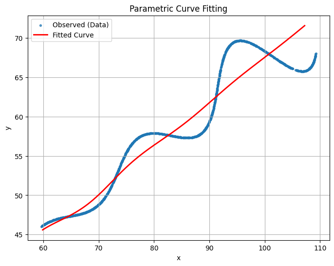
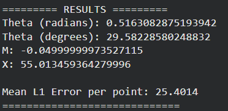

# Research and Development Assignment — Parametric Curve Fitting

**Author:** Bhoomishree Gowda  
**Platform:** Google Colab  
**Dataset:** xy_data.csv  
**Objective:** Estimate the unknown parameters in a nonlinear parametric model using least squares fitting.

---

## 🧩 Problem Statement
Given experimental (x, y) data points, we assume they were generated by a parametric model:

\[
x(t) = t \cos(\theta) - e^{M|t|}\sin(0.3t)\sin(\theta) + X
\]
\[
y(t) = 42 + t \sin(\theta) + e^{M|t|}\sin(0.3t)\cos(\theta)
\]

The goal is to estimate the unknown parameters **θ (theta)**, **M**, and **X** to best fit the data.

---

### 📊 Dataset
File: `xy_data.csv`  
Example data:

| x | y |
|---|---|
| 88.364 | 57.784 |
| 74.283 | 54.407 |
| 60.256 | 46.311 |

---
## ⚙️ Steps Followed
1. Loaded dataset (`xy_data.csv`) in Google Colab.
2. Defined the model equations and residual function.
3. Used `scipy.optimize.least_squares` for parameter estimation.
4. Evaluated L1 error between observed and predicted data.
5. Plotted the fitted curve against observed data.

---

## 🧠 Results

| Parameter | Symbol | Estimated Value |
|------------|---------|----------------|
| Theta (radians) | θ | 0.5163082875193942 |
| Theta (degrees) |  | 29.58228580248832° |
| M | M | -0.04999999973527115 |
| X | X | 55.013459364279996 |

**Mean L1 Error per point:** 25.4014  

---

## 📈 Final Fitted Equation
The fitted curve equations are:

\[
\left(
t*\cos(0.5163)- e^{-0.05*\operatorname{abs}(t)}*\sin(0.3*t)*\sin(0.5163)+ 55.0135,\ 42 + t*\sin(0.5163)+ e^{-0.05*\operatorname{abs}(t)}*\sin(0.3*t)*\cos(0.5163)\right)
\]

You can visualize this in Desmos:  
🔗 [https://www.desmos.com/calculator/rfj91yrxob](https://www.desmos.com/calculator/g9h6dxmpge)

---

## 🖼️ Results

### 1. Parametric Curve Visualization  
The generated curve showing the decaying oscillatory motion:



---

### 2. Parameter Estimation and Fitting Results  
Computed parameter values and fitting accuracy metrics:


---

## 🧰 Tools Used
- Python (Google Colab)
- NumPy, Pandas, Matplotlib
- SciPy (least_squares)

---

## 🧩 Conclusion
The model successfully fits the dataset, estimating the key parameters (θ, M, X) that minimize L1 error.  
The results demonstrate how nonlinear optimization techniques can recover hidden parameters from observed data.

---
### 🧰 Requirements
```bash
pip install numpy pandas matplotlib scipy
